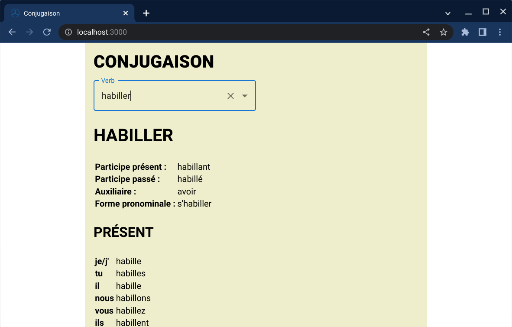
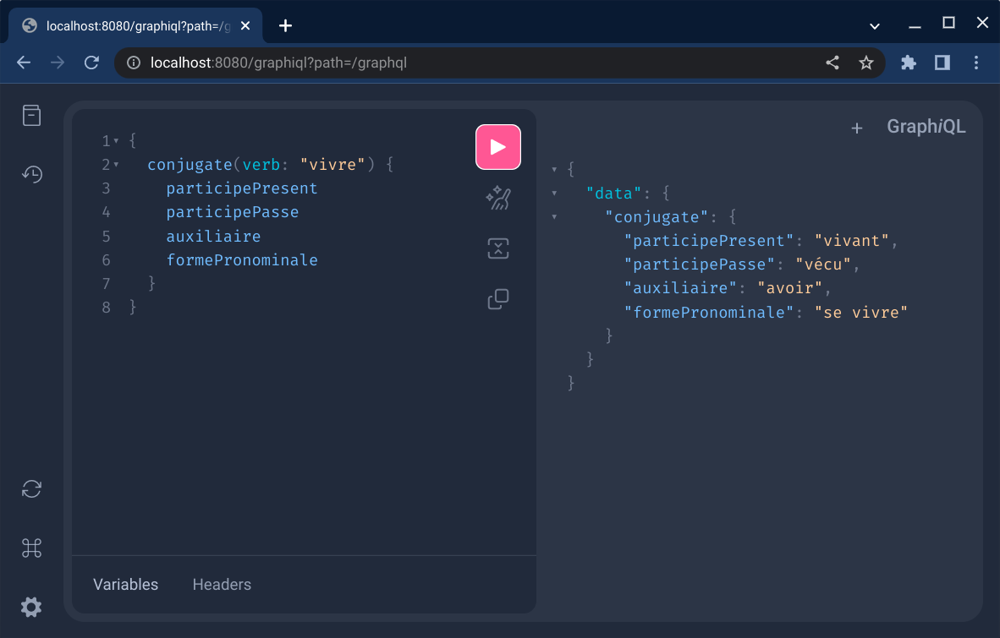

= Little table of French verb conjugation

- link:./service/[Spring Boot backend service] :
  provides a GraphQL API; stores data in MongoDB.

- link:./react-client/[React.js web app].

== Running the demo app

Assuming you have `docker` and `npm` installed, you should do the following.

First start the backend service:

[source, sh]
----
cd service
./gradlew bootJar
sudo docker compose up --build --detach
----

Then run `npm start` inside `react-client`.

You can open the web app at http://localhost:3000/

Visit http://localhost:8080/graphiql to play with the GraphQL API

== Conjugation data

The conjugation data comes from
link:./service/mongodb/mongo-dump.json[`service/mongodb/mongo-dump.json`].

It was scrapped from various sources.
Feel free to use it in your projects or suggest additions / corrections.

== API Schema

- link:./service/src/main/kotlin/org/cadadr/conjugaison/domain/VerbConjugation.kt[`org.cadadr.conjugaison.domain.VerbConjugation`]

- link:./service/src/main/resources/graphql/schema.graphqls[`GraphQL Schema`]
