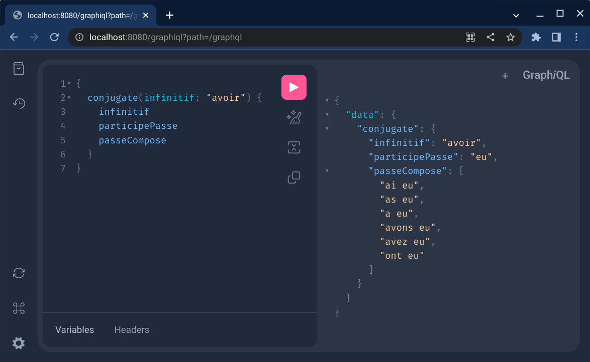

= Verb conjugation service

First run MongoDB locally:

[source, sh]
----
sudo docker run --name conjugaison-mongo -p 27017:27017 -d mongo:latest
----

Then start the service:

[source, sh]
----
./gradlew bootRun
----

Example of using http://localhost:8080/graphiql

